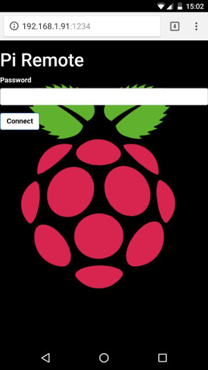
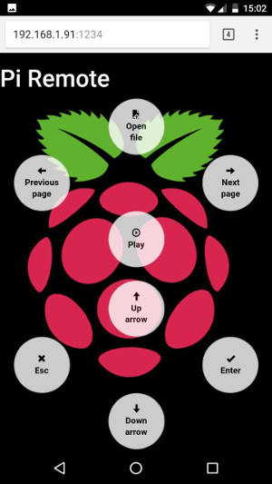

# Piremote

Very simple remote controller for PDF presentation. 
It is part of a work that involves Raspberry Pis and video projecting and it is intended to be run on a Raspberry Pi Zero W.

 &nbsp; 

### Prerequisites
To have a working environment for Piremote you need to have this software installed in your system:

* Python 2.7+ or 3.3+
* [PyUserInput](https://github.com/PyUserInput/PyUserInput) (depends on: [PyXlib](https://packages.debian.org/it/jessie/python-xlib))
* [netifaces](https://pypi.python.org/pypi/netifaces)
* [Tornado web framework](http://www.tornadoweb.org/en/stable/)

You can use this simple script to automatically install the needed software (this method was tested on a Raspbian Jessie OS 2017-07-05 image): 

```
#! /bin/bash

sudo apt update

# get and install PyUserInput module for Python
git clone https://github.com/PyUserInput/PyUserInput.git
python PyUserInput/setup.py install

# install missing packages
sudo apt install python-pip python-dev python-xlib

# to avoid permission errors when installing extensions
sudo chown -R $USER /usr/local/lib/python2.7/dist-packages/ 
pip install netifaces
pip install tornado

```

### Installing and running


To get and run Piremote:

```
git clone https://github.com/giulic3/pi-projector.git
cd pi-projector/piremote/
python -m piremote.main

```

## Usage

You can start Piremote with options to define specific behaviour

```
python -m piremote.main --address 192.168.1.71
python -m piremote.main --port 8888
python -m piremote.main --key yourkey
```
and combine them as you like.

## Authors

**Giulia Cantini** - giuliacantini3@gmail.com

## License

This project is licensed under the MIT License - see the [LICENSE](LICENSE) file for details.

## Acknowledgments

This project was inspired and readapted from [rereremote](https://github.com/ntrrgc/rereremote/).
